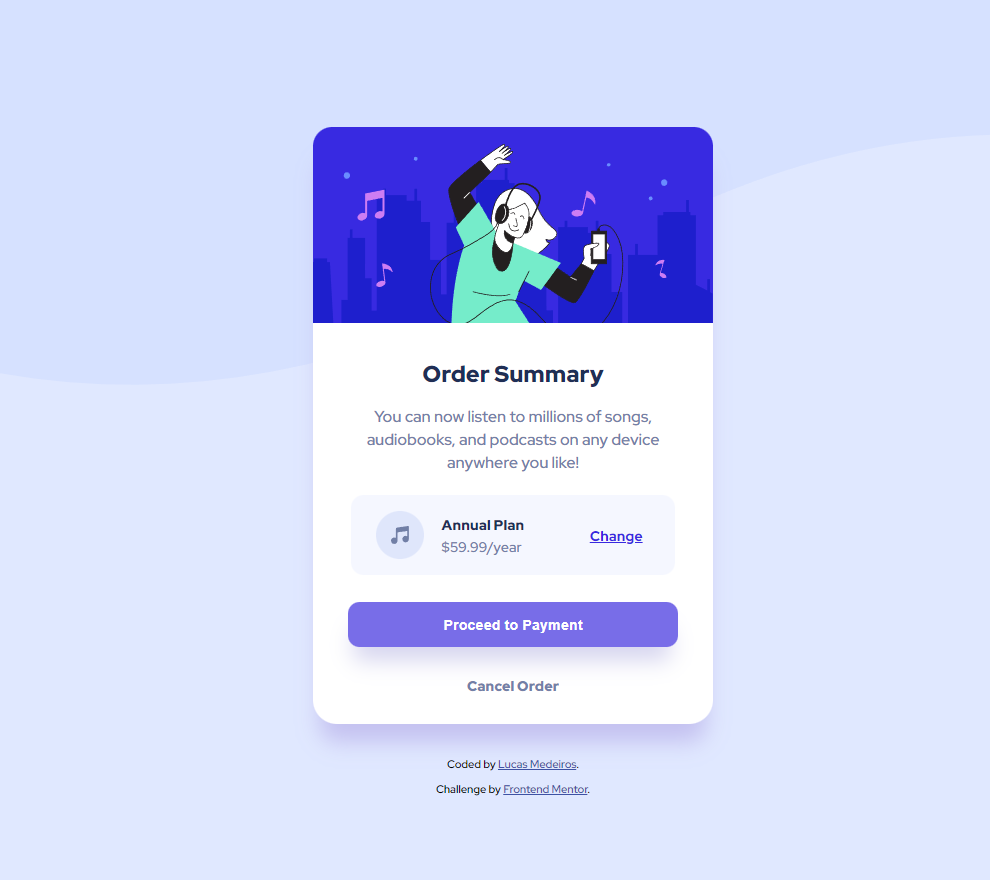

# Frontend Mentor - Order summary card > screenshot of my solution below.

# Frontend Mentor - Order summary card - Original

### The challenge

Users should be able to:

- See hover states for interactive elements

### What I learned

- I learned more about how wave background effects will behavior in the browser. 

- I'm more aware how box-shadows works.